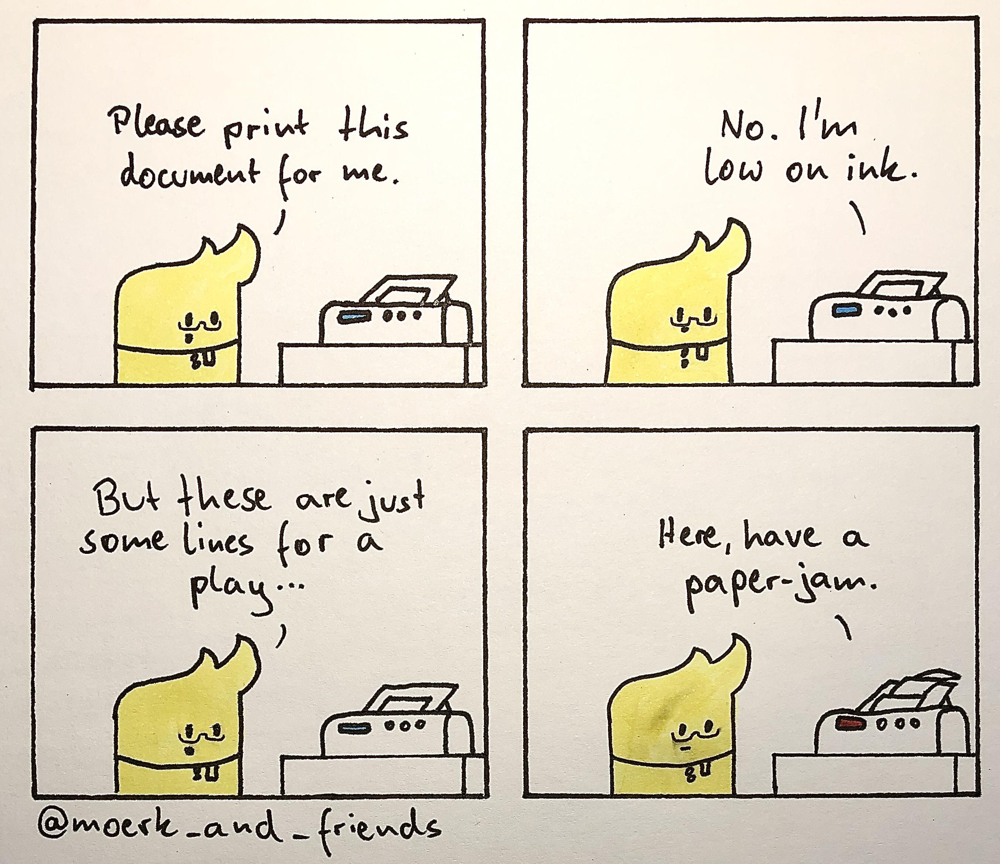

# **🗺️ JSON-Verne: Navigating the World of GeoJSON** 

A **clever** reference to **Jules Verne** and **GeoJSON**—because mapping history and data is an adventure! 🚀📍  

## **📌 Assignments Overview**  
Welcome, intrepid explorers! 🧭 Just as **Jules Verne** charted imaginary voyages, we will embark on a **journey through geographical data** using **GeoJSON** and **Python**.  

Each assignment will guide you through **data processing, fuzzy matching, and geospatial analysis**, leading to **interactive visualizations** of historical and modern locations.  

## **📜 Assignment 1: Nolli Map & OpenStreetMap Matching**  
### **🏛️ Historical Rome Meets Modern Data**  
In this **first mission**, you will work with the **Nolli Map**, a historic 18th-century map of Rome, and try to **match its landmarks with modern OpenStreetMap (OSM) data** using **fuzzy string matching**.  

### **🔍 What You’ll Learn**  
✅ How to **work with GeoJSON data** (points, features, and coordinates)  
✅ How to **extract data from a ZIP file**  
✅ How to **clean and structure JSON data** using Python dictionaries  
✅ How to **apply fuzzy string matching** to compare historic vs. modern place names  
✅ How to **export and visualize geospatial data** on **[geojson.io](https://geojson.io/)**  

### **📝 How to Start**
📂 Navigate to the **[`gottamatch-emall/`](./gottamatch-emall/)** folder.  
📖 Read the **README.md** inside for detailed instructions.  
🖥️ Open **`main.py`**—it’s full of **hints and comments** to guide you through the coding adventure.  

## **🚀 The Adventure Ahead!**  
Like Jules Verne’s heroes, you are **data explorers** on a **quest to uncover connections between past and present**. 🌍  

Believe it or not, working on these assignments will sometimes feel like this:  

  

**But don’t worry!** Stick with it, and soon you’ll master the art of GeoJSON, fuzzy matching, and geospatial analysis! 🔥  

## **Good luck, and may your data always be clean!** 🏆✨  

### **🔧 Need Help?**  
If you're lost in the data wilderness:  
- **Check the hints in `main.py`** 📌  
- **Review the functions in `utils.py`** 🛠️  
- **Experiment with printing variables** to debug 🔎  
- **Ask a fellow explorer (or your instructor)!** 🤝  

Now, set sail on your **GeoJSON-Verne adventure!** 🚀🌎
